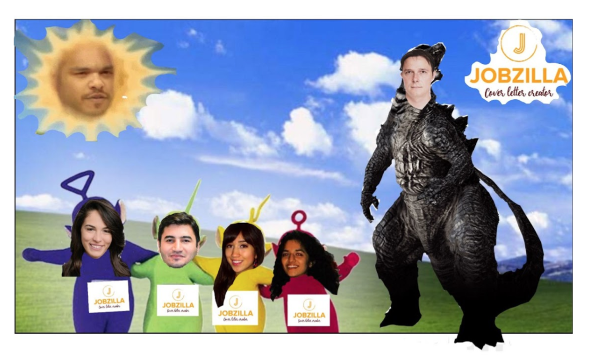
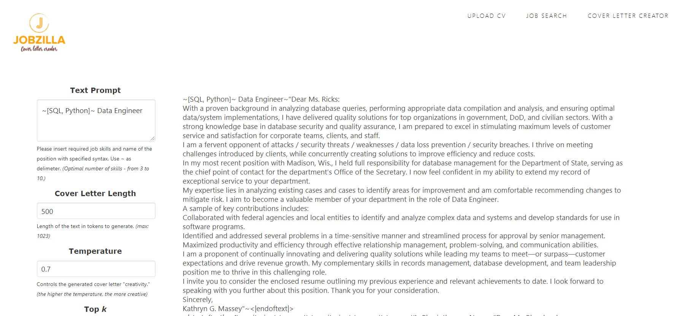

# st21-jobzilla
\_\_\_\_\_\_\_\_\_\_\_\_\_\_\_\_\_\_

Same text as below but with images: https://docs.google.com/document/d/1fFDFdxlIoaLuee0Gjih8htTXbiqfxoAAMLaypGDv-CE/edit?usp=sharing

#1 - Article/Blog Post

\_\_\_\_\_\_\_\_\_\_\_\_\_\_\_\_\_\_

**Jobzilla - A &quot;Cover Letter Creator&quot; Learning Project**

**by The Summer 2021 Team from TechLabs Berlin**

**The problem of the bot**

What if we were to ask you the question, &quot;Who in a hiring organization has the first check over incoming job applications?&quot;. Perhaps you might picture an HR Manager, or at least an employee who screens the applications before handing them up to someone higher in the chain. In any case, you probably have some kind of person in mind.

While this might be the case for some companies, this absolutely is not the case for all. Would you be surprised if we told you that nowadays, especially for large organizations, it is actually a bot that checks over applications, rather than a person?

The &#39;bot&#39; we are referring to is called ATS or Applicant Tracking System. ATS provides a way for companies to streamline the recruitment process by using software to track incoming applications, sort them and rank them for relevancy according to keywords, store them according to the company&#39;s needs, and to gather analytics on them when necessary. This means that the early-stage application reviews happen through the ATS, and only the candidates deemed relevant by the system move on to human eyes.

While the ATS makes the hiring process more efficient for the organization and removes mundane, repetitive steps for HR professionals and recruiters, a challenge is posed for job applicants. Jobseekers who aim to write a stellar cover letter and create a captivating CV now have the added worry that the documents should appeal not only to the recruiter, but also the ATS.

Some of you reading this might now get triggered into flashbacks of those times when you had to apply for jobs, remembering how painful it was to write dozens of cover letters each week with the aim of getting at least one or two calls back. And if it was hard to apply back then, you might be wondering if the ATS will now make it nearly impossible to successfully apply for a job and actually land one.

Luckily, we have a solution to this problem.

If you&#39;re trying to beat the ATS and get your application in front of the eyes of the actual recruiter, then look no further. Jobzilla allows you to beat the bot with… a bot!

**The solution for jobseekers is… Jobzilla!**

Jobzilla is an AI-driven app, which will find the best jobs for your unique set of skills and help to create cover letters so that no applicant tracking system (ATS) can resist! In just a few clicks, Jobzilla will enable you to start your new career journey.

Our goal was to create a way for the same model and same logic that powers ATS to be used to the application process as well. If we can speak the same &#39;language&#39; as the ATS of hiring organizations, we can better break through the barriers that prevent us from landing the interviews we deserve.

Powered by artificial intelligence, keyword extraction, and coupled with great web development and user interface, the Jobzilla app ensures that job applicants have a speedy way to generate their cover letters and get their applications in front of real recruiters. As a result of using Jobzilla, applicants should expect to enjoy a higher conversion rate on applications sent vs. interviews scheduled, increasing chances of landing that dream job!

\*

In this article, we will dive into what Jobzilla is and how it helps create ATS-friendly cover letters. But beyond this, we will also take you behind the scenes, allowing you to peer into the ins- and outs- as well as ups and downs of how our team created this app, despite no advanced knowledge of coding and design, and no prior experience developing a real-life app.

By the end of this article, you&#39;ll have a solid grasp on how the Techlabs Berlin program primed our team to jump into creating our very first project, and what struggles and successes we had along the way. You will hopefully be entertained by our newbie mistakes, informed by our learnings, and inspired by our drive to create a functional, working model. Lastly, we hope that you have a greater understanding of how Jobzilla could truly solve a real-world problem that exists for many jobseekers around the globe. Investors, prepare your wallets!

**The Creation Process**

It all started with 1 wonderful program and 1 big dream: to learn a new skill and directly apply it. This concept sounds simple, but it was a whirlwind to actually achieve.

Among the few hundred applicants to TechLabs Berlin&#39;s Summer 2021 semester, roughly 150 or so made it into the program. Once selected, these new students, otherwise known as &quot;techies&quot; were split into 4 &#39;tracks&#39;, or subject areas, namely: User Experience/User Interface, Data Science, Web Development and Artificial Intelligence. Many of these techies had no prior experience in tech whatsoever. Others had dabbled here and there. But in any case, we were all in it together to learn as much as possible. After some mingling and onboarding (online, of course), Week 1 of the &#39;Academy Phase&#39; officially began at the end of March.

After about 8 weeks of intense online learning in the Academy Phase, with a few techies dropping out of the program, we finally reached the big moment: the Project Phase, otherwise, the moment in which we had to directly apply what we learned. Admittedly, this was the scariest part for most of us. The Project Phase would last for 7 more weeks.

Dmitry, a participant of the Artificial Intelligence track, had come up with the idea of Jobzilla during the transition between the Academic and Project phases and pitched it during the Pitching Event, hosted by Techlabs. After the idea was pitched, eight more techies joined Dmitry to form a project team with the aim of getting our hands dirty in code and making the Jobzilla idea come to life.

With a team of 9 then formed, we had to navigate 100% of every aspect in this project from the ground up, despite no prior experience (other than the code and technical skills learnt in the Academic Phase). Again, many of the techies came from non-tech backgrounds such as business, environmental sciences, etc. Luckily, Techlabs allocated a &#39;mentor&#39; to us, Pedro, who is well-versed in professional Web Development. However, it was advised that the mentors take a hands-off approach in order to allow the techies to handle matters amongst themselves, asking for mentors&#39; help only when necessary. All in all, it was an immense challenge to dive headfirst into unknown territory.

Jobzilla&#39;s Early Weeks

The Google Meet session started.

Eyes shifting left, then right.

Awkward silence.

&quot;So… What should Jobzilla do?&quot;

Each of us were as confused as the next person.

Eventually the ice broke and ideas started to flow as to which features we could include into Jobzilla. Although the first concept was provided by Dmitry, our early weekly meetings allowed any of the 9 members to add their thoughts as to what the app could do, how we could do it, and how amazing it would be by the end.

A few of our initial plans in the early stage included the following:

1. Use &quot;Notion&quot; (a workspace application) to organize all of our notes and files, while &quot;Slack&quot; remains for regular, daily communication and messages
2. Have a &#39;simple version&#39;
3. Then move on to the &#39;complex version&#39; once we master the simple version.

The two versions mentioned above looked as follows:

SIMPLE VERSION:

- People use jobzilla to generate cover letters

- User will enter these details manually on a form (skills (hard skills, soft skills), what job /which company youre applying for, etc)

- Then user can generate their cover letter

- Jobzilla ensures that the cover letter has matching elements to the job description you&#39;re applying for to gain best chances at getting job

MORE COMPLEX VERSION:

- People also to find jobs, have a profile, apply and

- Our website/app, Jobzilla, will automatically connect with user profiles/job ads

- We upload our CV? Or just log in through Linkedin and info will be automatically brought over to Jobzilla

- When cover letter generated in a more automated way

And even a few extra features on the wishlist:

- The expenses taken on Saturday should be taken into account as part of our project expenses, a way to have evidence for the bus fares is by looking up your oyster card history online or at the top-up stations.

- Word clouds, word pairing / One window for job description / Have a job offer database

- Search engine to all other websites like (LinkedIn, indeed, ect) what tools are needs, how will it look.

- Create an interview or survey to the user to personalize the cover letter depending on their wants and needs.

As you see from the above, we had a TON of ideas.

So, we got to work.

Jobzilla&#39;s Mid-Stage &amp; Struggles

The middle of the Jobzilla journey was very fuzzy in memory. We were hard at work, yet experiencing difficulties with alignment between tracks, and had general communication problems amongst each other. Perhaps our feeling of unconfidence, or feeling inferior for not having the skills or knowledge to excel hindered us from expressing our struggles and asking for extra help. In any case, we were all moving forward, but at times it was unclear to others who was doing what, or where someone else was along the process.

Unfortunately for us, we lost 4 members along the way, as well. One dropped, then the next, and again. We were extremely grateful for their contributions as each of them brought a unique trait to the project, but we admit it created a slightly demotivating atmosphere each time we had to say goodbye to a valued teammate. This left 5 others core members: Dmitry - Concept Lead and Artifical Intelligence, Natasha - UX/UI, Ulvi - Web Development (fullstack), Iqra - Data Science, and Angela - Project Management.

All in all, we knew that if we wanted to finish in time (only 7 short weeks in total!), we had to step it up. With that in mind, we created a new strategy: to simplify our goals and ramp up our execution. The enormous list of features, wishes and desires was cut to only the most basic form. Our mentor, Pedro, wisely warned us often that time is short, and we need to wrap up something rather than chip away endlessly at perfection. We decided to take that approach and only focus on the most important features: A good design, functional web development, and a main model which would allow us to extract keywords to create a great cover letter.

Here we will outline what happened within each specific track to get a clearer picture of our activities, the technologies we used, the features we worked on, and the methods used to make it all come together.

Jobzilla&#39;s Tracks &amp; Functions:

**Data Science**

Iqra

For the data science track, we started out with the goal to gather cover letters with which we could assist the AI track in training the model. We collected 1944 cover letters from the websites Indeed and JobHero to train the AI team&#39;s GPT2 model.

Based on our UI/UX research we then started to work on making a full application pipeline. We aimed to begin accessing job listings data so that the user is able to search for the job and apply for it with their Jobzilla-generated cover letter at the end.

The first thing we did was deliberate about which API was easiest to work with. Finally we decided on the Indeed API, as we were advised that it was the friendliest to use. While we chose Indeed because it has the easiest to access API, in comparison with LinkedIn, we also found out through our survey that most people prefer Indeed to LinkedIn when searching for jobs.

The first step was to request client credentials from Indeed by sending an application. We successfully received a client ID and client secret code, which was subsequently used to create an authorization token and then an access token. The authorization token was created using a simple GET request, and the access token was created by returning the authorization code, client ID and client secret to indeed in a POST request. At this point we struggled to progress further, and ran into further obstacles with the Indeed API authorization code flow. This is because we noticed that to get access to Indeed job data we needed to create a publisher account, but our account was not approved by Indeed due to the lack of a working application and no site traffic. In the meantime, however, we found another solution by using the Adzuna API.

Adzuna allows us to query their database of job ads using title, location and keywords. The call for the Adzuna API consists of the function job\_search, defined with a GET request for the job data as a json file from the Adzuna API, which returns the information of job title, location of the job and skills needed in keywords.

**Artificial Intelligence**

Dmitry

From the AI perspective, our main goal was to create a machine learning model which was able to generate cover letters undistinguished from a human-written one. After reviewing different NLG approaches we have decided for the training already existing transformer model, as the most efficient approach.

The first training of the small 124-M parameters GPT-2 model with the dataset of collected cover letters gave us very impressive results (loss=0.19, avg=0.64, 1500 steps): the newly trained model was able to create the text on a very high qualitative level, but the content was not relevant to the candidate skills and job title. For the model training, we have adjusted gpt-2-simple framework from Max Woolf. [1]

To get more control over the model output we have decided also to add to the training dataset skills extracted from cover letters and job titles. To find this approach helped us the article from Ivan Lai. [2]

It was a challenge to find the most suitable model, which was able to extract correctly the skills from cover letters, but after some experiments with different NLP frameworks (BERT, TFIDF), we decided to use SpaCy Named Entity Recognition model (en\_core\_web\_sm) combined with EntityRuler for custom skills labeling. The skills dataset we found in Microsoft repository on Github. [3]

Although the used dataset had only ca. 2000 listed skills the final model matched with our expectations, most of the candidate skills in the tested cover letters were correctly identified:

Img 1: Example of original cover letter from training dataset for the position Data Scientist

The created NER (named entity recognition) framework helped us to add into the training dataset skills and job titles. The retrained GPT-2 based model was able to create a cover letter by prompting a set of skills, job title, or combination of both. In the results we were able to see that the generated text was relevant to the passed into the model information:

Img 2: Model output after prompt text: Data Scientist~python,sql,algorithms

We need to mention that the description of experiences, the name of the candidate as well as the recipient was created here by the model randomly. Our next step will be extending the controlled parameters by those options, but we expect that here might be implemented the same approach as with the skills.

In our results, we have seen that optimal results were achieved by using minimal numbers of skills as the prompt message – two or three, with a high probability those skills were recognized and implemented in the model text. Probably due to the small size of the training dataset the model was not capable of working with a bigger number of elements for proper prediction.

The collected learnings gave the model opportunity to ignore by the text generation those prompted skills which are completely uncommon for the specific job profile, so it was not possible to create a cover letter for a Data Scientist with mention of a car driving license as a skill, for example.

Another learning we have collected by the training is the fact that the used transformer model was able to recognize the weight of the specific skills via their count in the specific text. So it was also possible due to duplication of some skills in the prompt to increase their representation in the output text.

Finally, both models (cover letter generation and skill extraction) were set as API service (FastAPI) and containerized(Docker) and deployed into Google Cloud Platform which helped to bring them into production by Web Development.

[1] [https://github.com/minimaxir/gpt-2-simple](https://github.com/minimaxir/gpt-2-simple)

[2] [https://www.ivanlai.project-ds.net/post/conditional-text-generation-by-fine-tuning-gpt-2](https://www.ivanlai.project-ds.net/post/conditional-text-generation-by-fine-tuning-gpt-2)

[3] [https://github.com/microsoft/SkillsExtractorCognitiveSearch/blob/master/data/skill\_patterns.jsonl](https://github.com/microsoft/SkillsExtractorCognitiveSearch/blob/master/data/skill_patterns.jsonl)

**Web Development**

Ulvi

The Jobzilla website is designed using the latest web technologies available. This website is a fully static site built by using HTML &amp; supporting technologies. Because we do collect or store personal data or information that is entered in the online form by users, it was not necessary to build authentications.

For the Web Development (WD) track, there were two areas to be addressed: front-end and back-end. The front end was made with HTML, CSS, JavaScript, jQuery; while the back-end utilizes PHP (CodeIgniter framework).

Front end

The goal with the front end was to maintain a uniform appearance - every page of the website should look like it belongs to the same site. Total uniformity is maintained by using CSS. We managed to keep a uniform appearance through the background, font, colors, and size of the text. On all of the pages of the website, there is consistent font, color and size of headings, titles and paragraphs. We designed the Jobzilla website in such a way that it is compatible with most browsers, for example Mozilla Firefox, Apple Safari, Opera, and Google Chrome.

Back end

During web development on the backend, we faced a more challenging time while we were selecting between Node.js vs PHP. PHP coding is comparatively quicker and more straightforward than Node.js. Hence it was more attractive for us. On the other hand, Node.js seems to be a bit more complicated. The deployment of developed programs in Node.js is quite a complicated task.

Overall, we worked hard with the chosen technologies, and powered through the struggle. We believe that we have practically applied all the courses we have taken on Academic Phase to the best of our ability, and luckily we have ended up with a deployed model that functions as we planned.

**User Experience**

Natasha

For the UX track, we started out with the goal to create a cover letter making website, which during the first meeting started from there and became a judge project with many other add-ons involved. We knew that we needed to use pen and paper, Figma, Google docs, and other tools like Word and Excel to organize, make drafts, analyze, and plan our way, in order to fulfil the tasks of this track. But since we saw how complex it was going to be, the first thing we did was make a user experience road map of how the user experience should look like and go through it together, documenting it on a word document so we could use this as a guide for the web design and be able to easily edit depending on our needs and findings during the design and what seemed more user friendly.

 

Next, we create hand drawings of each page the user would be interacting with, to bounce off the ideas of what is missing, what should be changed or eliminated. After agreeing to the design drafts, we created a more understandable version for our peers. As we had to make sure we made the designs as understandable as possible, because we had to pass this on to the other tracks as a guide to what we want to achieve.

Meanwhile we also began creating various logo design drafts for the team to choose from and have the draft logos voted on, in the beginning so the team could use it and have a better feeling for what we are doing, as if it is more tangible.

   

It was a huge challenge for us when we had to learn how to use Figma, as it is not very intuitive and user friendly which took a lot of effort as first-time users. We overcame this challenge by constantly going back to all the online and video classes, as well to other basics on YouTube. We also divided our tasks, by whoever had a better sense of an area, that would be their task. So, whoever had a better grasp on the user journey, designs styles and analytics worked on creating the personas, working on the survey, making the initial drafts ideas and flowchart of how it all must flow and whoever had a better grasp on the technology used the other&#39;s draft to create it on Figma and then both would work on the final parts editing, as well as analyzing the collected data from the primary research and discussing the secondary research.

Check out our work on Figma here: [https://www.figma.com/file/J979BQQCpqCnWiIxXZJsxG/Jobzilla?node-id=0%3A1](https://www.figma.com/file/J979BQQCpqCnWiIxXZJsxG/Jobzilla?node-id=0%3A1)

Check out the results of our user research here: [https://docs.google.com/forms/d/1SsGorz0ZTIdNNmE-CzkspUyMkh0VB38invab\_AZaIoE/edit#responses](https://docs.google.com/forms/d/1SsGorz0ZTIdNNmE-CzkspUyMkh0VB38invab_AZaIoE/edit#responses)

Early-stage Flowchart

The journey was much different than I expected, as a lot of what I did as a consultant and a primary market research interviewer came up during this project, which is why I had taken over those areas of the project, at the beginning, but then had to take up all the areas when my colleague had to leave the project due to personal reasons. Even though our colleague left, I was happily surprised with our results, even though they were more of an MVP than I had imagined at first, as the team was highly optimistic for the project to be so complex, I was a bit worried as I for one was not very reliant on my skills at the beginning and even more when other members were leaving the project. But the remaining team being so pumped all the time and being so supportive of one another really helped me get motivated to keep going, do as much as I can to make sure not to let them down and complete this project.

  
  

End-stage flowchart

As the final weeks started to approach, we felt stressed and anxious as time was running out, the reality of our experience and having to go back to the studies and videos was so constant, so we were a bit worried about completing in time. But we were also overly excited with what we had been able to accomplish so far.

**Project Management**

Although Project Management was not a &#39;track&#39; within the TechLabs Berlin project, it was an avenue pursued by Angela after she found difficulty picking up the concepts taught in the Data Science track while balancing full time work hours. Although this felt like a failure at first, there were actually some valuable lessons learnt:

1. Data science is not to be underestimated. It is a fascinating and complex field that does require your full attention. If you have other matters on your mind and cannot dedicate full focus, you might have difficulties with this discipline.
2. Life will throw hurdles at you, and sometimes the best solution is to take a pause and save something for another time. It&#39;s ok to &#39;give up&#39; and try again later. If you are experiencing difficulties with other things, one of the best things you can do for yourself is take a few things off your plate in order to find balance. When those other things are cleared, you can always pick up more things and fill the plate once more. You are not a &#39;failure&#39; simply because you need to prioritize - you are just prioritizing.
3. There is always a way to contribute. No matter how you help, your time and effort is still indeed a help, and might even be more valuable than if you would have stuck to the original plan.

It turned out that having someone in the role of &#39;project manager&#39; was a positive asset to the team, as all other tracks were busy doing the track-related tasks. The project management role kept deadlines secure, allowed better communication between tracks and members, kept techies notified of changes or meeting dates, and ensured that tasks such as writing, organizing, or general decision making were handled.

Furthermore, the project management role made for a great opportunity to be involved with a technical project and still gain hands-on experience with using people and leadership skills to build a website.

**Mentorship**

Pedro did a great job of offering help when asked, but never dominating our management, execution, or ideation. When we had a technical question, especially regarding Web Development, he always answered it to the best of his ability, and for that we are very grateful. We appreciated his positive outlook, his willingness to offer his best insights, and his generosity with freeing up his time to help us - often during the early hours of the morning halfway across the globe in Brazil!

Zubin, who was TechLabs Berlin&#39;s AI &amp; DS Track Lead, often came to the rescue as well when we had a technical question that was deeper in the field of data science. His answers were always immense and detailed, which got us out of a few pickles during the Jobzilla Project Phase. His passion and excitement always got us fired up about what we can do next to make the project as best as possible.

Wrapping up the Jobzilla Project

By the end of the 7 weeks in the project phase, the following was successfully completed:

- A final presentation to the entire Techlabs Berlin Summer 2021 Semester group about what Jobzilla is and how it works (recording available which includes demo walkthrough of finished website)
- A Github repo filled with goodies from building Jobzilla
- A long, hard semester and a feeling of accomplishment

And most importantly:

- A deployed model on [https://coverletter.aibdsoft.com](https://coverletter.aibdsoft.com/) ! Yes, this is our real prototype! Give it a try :)

Here in these screenshots we can see the process of how the website is used:

1st upload CV

2nd fill out job search

3rd results of job search

4th click cover creator button then fill out text prompt (but correctly with symbols)

5th output is given, resulting in an AI-generated cover letter.

**Conclusion - Jobzilla and the Summer &#39;21 Semester**

What started as a daunting, intimidating project turned out to be functional, completed AI-driven website that reflects our hard work as new practitioners of the skills we gained in the TechLabs program. Not only did we solve a real world problem (creating an app that &quot;fights the bot problem with a bot&quot;), but we did so using skills that we had never exercised prior to this program.

Beyond creating a great app, we overcame challenges and modified our original plans in order to solve the end problem with the time constraints we had. We had to be fairly agile and adaptive in this regard, but in the end we completed the project on time and bonded as a team while doing so. In fact, at the end of the project we happily realized that we never had any arguments or any drama with each other along the way, which is a big accomplishment for a group of diverse people working under pressure. We are all grateful for the experience and proud of the end product.

We hope you have enjoyed this reflection of the Jobzilla x Techlabs Berlin journey, and we are happy to hear any feedback you may have about these learnings or about this project.

Feel free to reach out with enquiries by writing us on Linkedin! We would be happy to hear your thoughts.

The team, in silly form.

Sun = Pedro (Mentor)

Godzilla = Dmitry (Concept Lead and AI)

Teletubbies left to right: Natasha (UX/UI), Ulvi (WD), Angela (PM), Iqra (DS)

\_\_\_\_\_\_\_\_\_\_\_\_\_\_\_\_\_\_\_

#2 - 200-300 word Project Summary

\_\_\_\_\_\_\_\_\_\_\_\_\_\_\_\_\_\_

Have you ever wondered why it takes hours to write your CV and cover letter, but just seconds to get rejected?

Have you ever been frustrated as a jobseeker, knowing that the perfectly curated words on your job application never make it to the eyes of the actual recruiter?

In today&#39;s world, ATS (Applicant Tracking Systems) are often used by companies to streamline the recruitment process. While this offers many benefits to the company, it poses challenges to the applicants who aim to cut through the noise and get their applications noticed.

The solution? Jobzilla!

Jobzilla is an AI-driven app which will find the best jobs for your unique set of skills and help to create cover letters so that no ATS can resist!

Jobzilla automates the cover-letter-writing process by extracting relevant keywords from the job description and your CV, then quickly generating an ATS friendly cover letter as output. The result? An easy to use, fast solution for job applicants to start their career journey in just a few clicks.

Created during the &quot;Project Phase&quot; of TechLabs Berlin&#39;s &#39;Digital Shaper Program&#39;, Jobzilla unifies the Artificial Intelligence, Web Development, User Experience and Data Science tracks to create a hands-on learning environment to help solve real-world issues. In just 7 weeks, the Jobzilla team went from 0 to hero by conceptualizing and building all necessary components in order to create a functional and deployed cover letter creator app.

\_\_\_\_\_\_\_\_\_\_\_\_\_\_\_\_\_\_\_

#3 - Techlabs Final Submission Typeform

\_\_\_\_\_\_\_\_\_\_\_\_\_\_\_\_\_\_

Submitted by Natasha :)

1. What is your Project?This question is required. \*
  1. jobzilla
2. What is the email we can reach you on?This question is required. \*
  1. bickmorebusiness@yahoo.com
3. What are the team members you have FINISHED the project with?This question is required. \*
  1. Dmitry, Iqra, Ulvi, Natasha, Angela
4. Link to your slides.This question is required. \*
  1. [https://docs.google.com/presentation/d/18Z\_YP2U6DR91LbO6zXfyC\_KT4Y0v5NAwqnCvbgqeu24/edit?usp=sharing](https://docs.google.com/presentation/d/18Z_YP2U6DR91LbO6zXfyC_KT4Y0v5NAwqnCvbgqeu24/edit?usp=sharing)
5. Do you have the required blog-post (minimum 750 words ) as markdown-text in your repository, including all the required assets (images/pictures etc.)?This question is required. \*
  1. Yes…..
6. Do you have the required project summary (200-300 words), which we will put on your certificate, as a markdown-file in your Github repository?This question is required. \*
  1. Yes…..
7. Link to your project&#39;s GitHub repo.This question is required. \*
  1. [https://github.com/orgs/TechLabs-Berlin/teams/st21-jobzilla](https://github.com/orgs/TechLabs-Berlin/teams/st21-jobzilla)
8. Link to your deployed project. i.e. on Heroku (you can skip this question if you did not deploy it)
  1. [https://coverletter.aibdsoft.com](https://coverletter.aibdsoft.com/)
9. Links to LinkedIn profiles of all the team members that you have finished the project with?
  1. [https://www.linkedin.com/in/bickmoreangela/](https://www.linkedin.com/in/bickmoreangela/)
  2. [https://www.linkedin.com/in/dmpankov/](https://www.linkedin.com/in/dmpankov/)
  3. [https://www.linkedin.com/in/iqra-nowshari-30a76118a/](https://www.linkedin.com/in/iqra-nowshari-30a76118a/)
  4. [https://www.linkedin.com/in/ulvi-amanov-a9224855/](https://www.linkedin.com/in/ulvi-amanov-a9224855/)
  5. [https://www.linkedin.com/in/natasha-owen-bermudez/](https://www.linkedin.com/in/natasha-owen-bermudez/)
10. That&#39;s it :)

